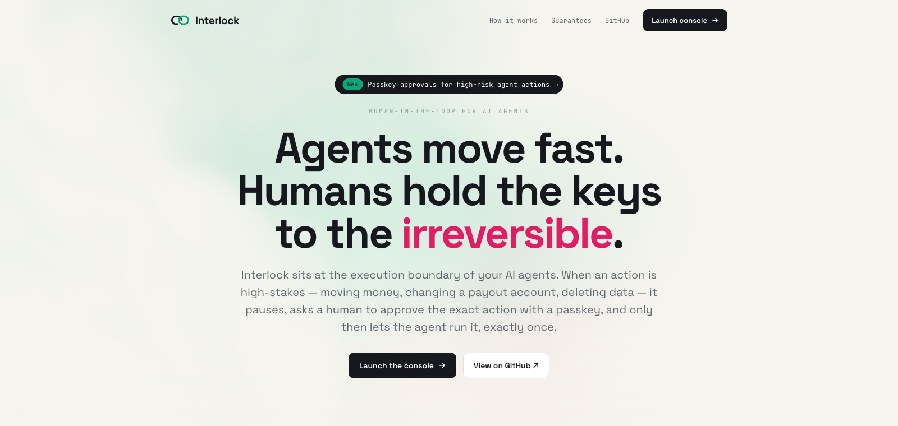
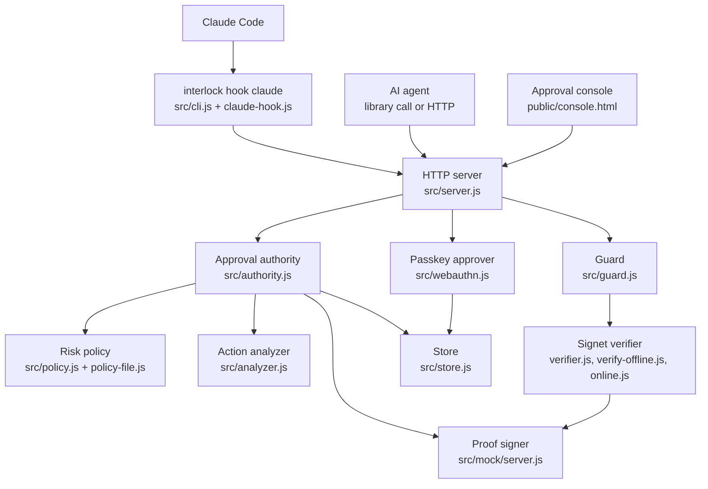
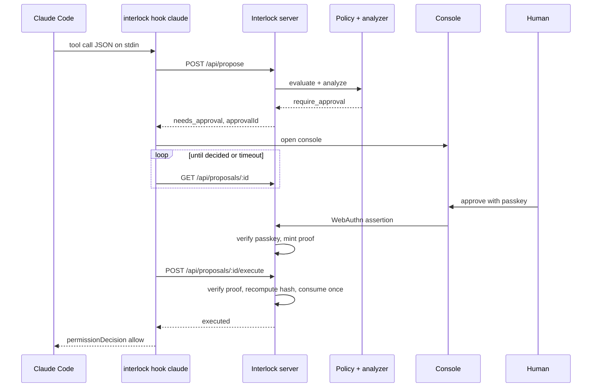
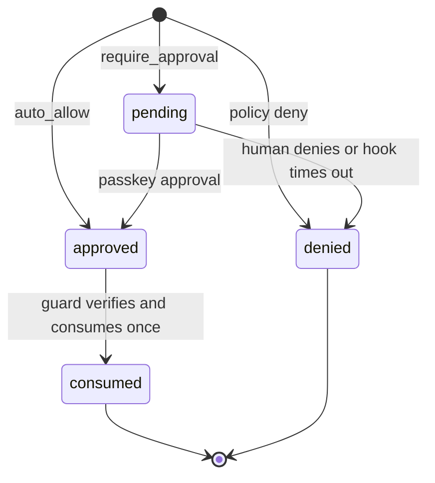

<p align="center">
  
</p>

# Interlock

<p align="center">
  
  
  
  <a href="docs/claude-code.md"></a>
</p>

Interlock is a human-in-the-loop circuit breaker for high-risk AI-agent actions.
An agent proposes an action; a risk policy decides whether it can run on its own,
needs a person, or must be refused. For the actions that need a person, someone
approves **the exact action** with a passkey, and only then does the agent get a
single-use, action-bound proof that lets it run that action exactly once. Every
other path fails closed.

It is built on a small verification core called **Signet**: ES256-signed proofs
that are verified and consumed exactly once, so "approved" is backed by
cryptography rather than a flag an agent could flip.

## Quick Start

```bash
git clone https://github.com/Meraj-08/interlock.git
cd interlock
npm install
npm test                # 114 tests
npm run demo            # narrated offline walkthrough
npm run serve           # service + console on http://localhost:4000
```

Open `http://localhost:4000/console`, register a passkey with the setup code the
server printed, and approve the pending demo request.

To guard Claude Code, start the server with a policy and add the hook
([full setup](docs/claude-code.md)):

```bash
npx interlock serve --policy examples/interlock.policy.json
```

```json
{
  "hooks": {
    "PreToolUse": [
      { "matcher": "Bash|Write|Edit",
        "hooks": [{ "type": "command", "command": "npx interlock hook claude --timeout 280", "timeout": 300 }] }
    ]
  }
}
```

Requirements: Node.js 18 or newer. No API keys or accounts; everything runs
offline.

## Purpose

The dangerous case for AI agents is not reading a row. It is the irreversible
action: wiring money, deleting a tenant, force-pushing over shared history,
emailing every customer. For those you want a deliberate human decision, and a
guarantee that what the human approved is exactly what runs.

| Area | What Interlock does |
| --- | --- |
| Risk policy | Classifies every proposed action as `auto_allow`, `require_approval`, or `deny`, from code or a JSON policy file |
| Risk analysis | Looks inside the action (large amounts, new destinations, deletions, sensitive data) and escalates to a human when needed |
| Human approval | Asks a person to approve the exact, frozen request with a WebAuthn passkey |
| Action binding | Binds the proof to a hash of the request, so "approve $10, execute $10,000" is refused |
| Exactly once | Consumes each proof once; replays and double-spends are refused |
| Fail closed | Refuses on any doubt: bad signature, expiry, mismatch, outage, timeout |
| Agent integration | Guards Claude Code tool calls through a `PreToolUse` hook |
| Target-side checks | Lets the service that performs the action verify and consume the receipt itself, so bypassing the agent-side guard does not help |

## Architecture



### Runtime Flow

The flow for a Claude Code tool call that needs a person:



### Proposal Lifecycle



## Project Structure

```text
interlock/
|-- src/
|   |-- policy.js           # RiskPolicy: auto_allow / require_approval / deny
|   |-- policy-file.js      # JSON policy files: validation + rule compilation
|   |-- analyzer.js         # ActionAnalyzer: risk findings, escalation
|   |-- authority.js        # ApprovalAuthority: proposal lifecycle + proof minting
|   |-- guard.js            # Guard: execution boundary, exactly once, fail closed
|   |-- webauthn.js         # WebAuthnApprover: passkey registration + approval
|   |-- server.js           # InterlockServer: HTTP API + serves the site
|   |-- serve.js            # startServer(): service + durable state + policy file
|   |-- cli.js              # the `interlock` command line
|   |-- claude-hook.js      # Claude Code PreToolUse hook
|   |-- receipt.js          # requireReceipt(): receipt checks in the target service
|   |-- store.js            # MemoryStore / FileStore
|   |-- verifier.js         # Signet: two-phase verification
|   |-- verify-offline.js   # Signet: signature + claim checks
|   |-- online.js           # Signet: online verify + one-time consume
|   |-- action-hash.js      # canonical request hash
|   |-- jwks.js  replay.js  reasons.js
|   `-- mock/server.js      # local signer (persists its key and proofs)
|-- bin/
|   |-- interlock.js        # `interlock` command
|   `-- serve.js            # `npm run serve` (= interlock serve --demo)
|-- public/                 # landing page, approval console, logo
|-- examples/
|   |-- demo.js             # narrated offline walkthrough
|   |-- receipt-demo.js     # a payments API that only trusts receipts
|   `-- interlock.policy.json
|-- docs/                   # Claude Code guide, screenshots
`-- test/                   # node:test suites + Claude Code hook fixtures
```

## Core Design

### Risk Policy

`RiskPolicy` evaluates rules in order; the first match wins, and anything not
matched gets the default outcome (`require_approval` unless set). Rules can be
written in code with `rule()`, or loaded from a JSON policy file (see
[Configuration](#configuration)).

### Action Analyzer

Where the policy makes a coarse call, `ActionAnalyzer` looks into the action
itself and returns findings with a severity:

| Signal | Severity |
| --- | --- |
| Amount of 10,000 or more | critical |
| Amount of 1,000 or more | warning |
| Destination not seen before | warning |
| Irreversible deletion | critical |
| Permission or access changes | warning |
| Sensitive data in the payload | critical |
| Changes where future money is sent | warning |

A warning or critical finding turns an `auto_allow` into `require_approval`, and
the findings are shown to the reviewer. The rules are heuristic and run offline;
pass a `reviewer` function to plug in an LLM-based review.

### Approval Authority

`ApprovalAuthority` owns the proposal lifecycle. When an agent proposes an
action, it freezes the request (agent, user, action, params, resource) and
computes its canonical hash. An approval mints an ES256 proof bound to that hash,
with a short lifetime (300 seconds by default). Approving twice does not mint a
second proof.

### Passkey Approval

`WebAuthnApprover` runs real WebAuthn ceremonies. An approver registers a passkey
once; each approval then needs a fresh assertion scoped to that one proposal.
Only after the assertion verifies does the authority mint the proof.

- Registration needs the setup code that `serve` prints at startup.
- An approver who already has a passkey cannot be registered again over the API.
- The HTTP route that approves without a passkey is off unless the server is
  created with `allowClickApproval: true` (tests and demos only).

### Guard and Signet

`Guard.execute(approvalId, fn)` is the execution boundary. It recomputes the
request hash from the params the agent is actually about to use, then asks the
Signet verifier to check the proof in two phases: offline (signature and claims)
and online (status and one-time consumption). Only then does it run `fn`, once.

Refusals carry a reason code:

| Reason | Meaning |
| --- | --- |
| `awaiting_approval` | no approval yet |
| `denied` | the request was denied |
| `invalid_signature`, `unknown_kid`, `malformed` | the proof is not genuine |
| `expired`, `not_yet_valid` | outside the proof's lifetime |
| `action_mismatch`, `action_hash_mismatch` | the action or its params changed after approval |
| `actor_mismatch`, `audience_mismatch` | wrong agent or wrong service |
| `replayed` | the proof was already used |
| `unavailable` | the authority could not be reached (fail closed) |

### Receipts in the Target Service

The guard protects the agent's side. A receipt lets the service that actually
performs the action (the payments API, the database admin endpoint) check the
approval itself, so an agent that skips the guard gets nowhere.

```js
import { requireReceipt } from 'interlock/receipt';

app.post('/transfers', requireReceipt({
  interlock: 'http://localhost:4000',
  action: 'payments.transfer',
  params: (req) => ({ to: req.body.to, amount: req.body.amount }),
}), (req, res) => {
  // Runs only for the exact approved transfer, once.
  // req.interlock = { subject, actor, claims }
});
```

The agent fetches its receipt with `GET /api/proposals/:id/receipt` after the
approval and sends it in the `Interlock-Receipt` header. The service then:

1. recomputes the action hash from **its own** request params;
2. verifies the proof's signature and bindings against Interlock's public keys;
3. consumes it once at Interlock (`POST /api/v1/verify`), the same single-use
   record the guard uses, so a receipt spent at the service cannot also be
   executed through the guard, and the other way round.

No receipt gets `401 receipt_required`; anything else wrong gets
`403 receipt_refused` with a reason (`consumed`, `action_hash_mismatch`,
`action_mismatch`, `revoked`, `unavailable`, ...). `verifyRequest(req, opts)` is
the same check without a framework. Run `npm run demo:receipt` to see it end to
end.

The receipt carries the proof plus the context Interlock froze at proposal time
(nonce, subject, actor, resource). That context is not trusted: it only feeds
the hash, so changing any of it makes the hash differ from the signed one. The
params must match the approved ones exactly, including types.

### Storage

State lives in a `Store`: `MemoryStore` for tests and `FileStore`
(`data/interlock.json` by default) for the service, so passkeys, proposals,
proofs, and one-time consumption survive a restart.

## Configuration

### Policy File

```json
{
  "default": "require_approval",
  "rules": [
    { "id": "never-delete-accounts", "match": { "action": "account.delete" }, "outcome": "deny" },
    { "id": "force-push-needs-human",
      "match": { "action": "Bash", "params": { "command": "git\\s+push\\b.*(--force|-f\\b)" } },
      "outcome": "require_approval", "reason": "force-pushing rewrites shared history" },
    { "id": "small-refunds",
      "match": { "action": "refund.issue", "params": { "amount": { "lt": 100 } } },
      "outcome": "auto_allow" }
  ]
}
```

Everything in `match` must hold for the rule to apply:

| Field | Matches |
| --- | --- |
| `action` | exact name, `*` wildcard (`"read.*"`), or a list of either |
| `riskClass` | `low`, `elevated`, `high`, `critical`, or a list |
| `params.<name>` | a string is a regular expression searched in the value; a number or boolean must be equal; or an object of operators: `lt`, `lte`, `gt`, `gte`, `eq`, `in`, `regex` |

An empty `match` matches everything, and numeric operators never match a missing
or non-numeric value. The file is checked when it loads: an unknown field, a bad
regex, or a wrong type is an error naming the rule and field. Claude Code tool
calls are matched as `action` = tool name and `params` = tool input. A complete
example is in [`examples/interlock.policy.json`](examples/interlock.policy.json).

### Observe Mode

A rule in observe mode is evaluated and recorded but never blocks or holds
anything, so you can try a policy on real traffic before it can get in the way:

```json
{
  "defaultMode": "observe",
  "rules": [
    { "id": "no-rm-rf-root", "match": { "action": "Bash", "params": { "command": "rm\\s+-rf\\s+/$" } },
      "outcome": "deny", "locked": true },
    { "id": "force-push-needs-human", "match": { "action": "Bash", "params": { "command": "push.*--force" } },
      "outcome": "require_approval" },
    { "id": "drop-table", "match": { "action": "Bash", "params": { "command": "DROP TABLE" } },
      "outcome": "require_approval", "mode": "enforce" }
  ]
}
```

| Field | Meaning |
| --- | --- |
| `mode` | `observe` or `enforce` for one rule |
| `defaultMode` | mode for rules without one, and for the fallback (default `enforce`) |
| `locked` | `true` makes a rule always enforce, whatever `defaultMode` says |

Every decision records `mode` and `wouldHave` (what enforce mode would have
done). An observed call runs as if it were auto-allowed; the console lists it
under "Observed only" with the rule it matched. When the observed decisions
look right, switch the rules to `enforce`.

### Environment Variables

| Variable | Used by | Purpose |
| --- | --- | --- |
| `PORT` | `serve` | port to listen on (default 4000) |
| `INTERLOCK_POLICY` | `serve`, `policy check` | policy file path |
| `INTERLOCK_SETUP_CODE` | `serve` | setup code for passkey registration (default: random, printed at start) |
| `INTERLOCK_URL` | `hook claude` | Interlock server URL (default `http://localhost:4000`) |
| `INTERLOCK_USER` | `hook claude` | who the agent acts for (default: your login) |

## CLI Usage

```bash
npx interlock --help
npx interlock serve --port 4000 --policy interlock.policy.json
npx interlock policy check interlock.policy.json
npx interlock hook claude --timeout 280
```

| Command | Status | Purpose |
| --- | --- | --- |
| `interlock serve` | implemented | service + console (`--port`, `--policy`, `--data`, `--setup-code`, `--demo`) |
| `interlock policy check [file]` | implemented | validate a policy file and print a summary, including rules in observe mode |
| `interlock hook claude` | implemented | Claude Code hook (`--server`, `--timeout`, `--user`, `--no-open`) |
| `interlock trail verify` | planned (#5) | verify the audit trail |

Every command takes `--help`. Exit codes: `0` success, `1` the command failed,
`2` usage error.

## Guarding Claude Code

`interlock hook claude` runs before each matched tool call:

| Policy result | What Claude Code sees |
| --- | --- |
| `deny` | the call is blocked, with the rule's reason |
| `require_approval` | the console opens; a passkey approval allows the call, a denial or timeout blocks it |
| `auto_allow` | no objection; Claude Code's normal permission prompts apply |
| server down, bad input | the call is blocked (fail closed) |

On a timeout the request is also closed on the server, so a late approval cannot
be used. Keep the hook's `--timeout` below Claude Code's hook `timeout`. Setup
and options: [docs/claude-code.md](docs/claude-code.md).

## HTTP API

| Method and path | Who | What it does |
| --- | --- | --- |
| `POST /api/propose` | agent | policy decision and an `approvalId` |
| `GET /api/proposals` | console | proposals, newest first |
| `GET /api/proposals/:id` | agent, console | one proposal's state |
| `POST /api/webauthn/register/options` and `/verify` | human | register a passkey (needs the setup code) |
| `POST /api/proposals/:id/approve/options` and `/verify` | human | approve with a passkey; mints the proof |
| `POST /api/proposals/:id/deny` | human | deny |
| `POST /api/proposals/:id/execute` | agent | verify and consume the proof once |
| `GET /api/proposals/:id/receipt` | agent | the receipt for an approved, unused proposal (`409` if not approved, `410` if used) |
| `GET /.well-known/interlock.json` | target service | issuer, audience, and environment to verify against |
| `GET /.well-known/graypass-proof-keys.json` | target service | public keys (JWKS) |
| `POST /api/v1/verify` | target service | check a proof and consume it once |

## Use as a Library

```js
import { ApprovalAuthority, Guard, RiskPolicy } from 'interlock';

const authority = await ApprovalAuthority.create({
  policy: await RiskPolicy.fromFile('interlock.policy.json'),
});
const guard = new Guard({ authority });

// 1. The agent proposes an action.
const decision = await guard.propose({
  agent: 'agent_support_bot',
  onBehalfOf: 'user_42',
  action: 'refund.issue',
  params: { amount: 5000, currency: 'USD', order: 'ord_9' },
  riskClass: 'high',
  consequence: 'Refund $5,000 to the customer card.',
});

// 2. If it needs a person, they approve it (a passkey ceremony in the console).
if (decision.outcome === 'needs_approval') {
  await authority.approve(decision.approvalId, { approver: 'ops_alice', method: 'passkey' });
}

// 3. The agent runs the action through the guard: verified, consumed, run once.
const result = await guard.execute(decision.approvalId, () => issueRefund(5000));
if (!result.executed) handleRefusal(result.reason);
```

## Security Model

Each row has a test:

| Scenario | Result |
| --- | --- |
| Low risk or small amount | `auto_allow`, runs without a person |
| High risk or large amount | `needs_approval`, held for a person |
| Execute before approval | refused (`awaiting_approval`) |
| Approved, then executed | runs exactly once |
| Same approval replayed | refused (`replayed`) |
| Approve $10, execute $10,000 | refused (`action_hash_mismatch`) |
| Person denies | refused (`denied`) |
| Deny-listed action | `deny`, no approval offered |
| Authority unreachable | refused (`unavailable`), fails closed |
| Approve twice | idempotent, no second proof |
| Approve over HTTP without a passkey | refused (`passkey_required`) |
| Register a passkey without the setup code | refused (`setup_code_required`) |
| Register again for an approver with a passkey | refused (`already_registered`) |
| Rule in observe mode | recorded with `wouldHave`, never blocked or held |
| Locked rule under `defaultMode: observe` | still enforced |
| Target service: no receipt | refused (`receipt_required`) |
| Target service: receipt used twice | refused (`consumed`) |
| Target service: params changed after approval | refused (`action_hash_mismatch`) |
| Target service: binding context altered | refused (`action_hash_mismatch`) |
| Receipt used at the target, then through the guard | refused |
| Claude Code hook: server down or bad input | call blocked |
| Claude Code hook: no answer in time | call blocked, request closed |

Limitations:

- An agent running as the same OS user on the same machine as the server can
  read and edit the server's state file. For real protection, run Interlock
  where the agent cannot reach its files (another machine or user).
- WebAuthn `rpID` and origin come from the request `Origin`, which works on
  localhost. Set them explicitly behind a proxy or custom domain.
- `FileStore` is durable for a single process. For several workers, back the
  store with Redis or Postgres.
- The canonical action hash is a documented, deterministic form applied the
  same way on both sides. Swap in a provider's official hasher for live use.
- Anyone who knows an approval id can fetch its receipt, and anyone holding a
  receipt can spend it. Either way it only runs the exact approved action,
  once. Keep approval ids to the agent that asked.

## Development

```bash
npm install
npm test                # node:test, no extra dependencies
npm run demo            # approval, tamper, deny, and outage paths
npm run demo:receipt    # a payments API that only trusts receipts
npm run serve           # service with a seeded demo request
```

| Test file | Covers |
| --- | --- |
| `verify.test.js` | Signet: signatures, claims, expiry, one-time consume |
| `hitl.test.js` | the propose → approve → execute loop and refusals |
| `analyzer.test.js` | risk findings and escalation |
| `policy.test.js` | policy files: matching, validation, errors |
| `server.test.js` | the HTTP API end to end |
| `webauthn.test.js` | passkey registration and approval options |
| `registration.test.js` | setup code and no-replacement rules |
| `persistence.test.js` | state surviving a restart |
| `cli.test.js` | commands, flags, exit codes |
| `claude-hook.test.js` | the Claude Code hook, with real hook-input fixtures |
| `observe.test.js` | observe and enforce modes, locked rules |
| `receipt.test.js` | receipt checks in a separate target service |

## Roadmap

Tracked in [#9](https://github.com/Meraj-08/interlock/issues/9):

| Issue | Feature | Status |
| --- | --- | --- |
| #1 | Risk rules from a policy file | done |
| #3 | `interlock` CLI | done |
| #4 | Claude Code passkey approval hook | done |
| #14 | Setup code for passkey registration | done |
| #2 | Observe and enforce modes per rule | done |
| #6 | Receipt verification middleware for target services | done |
| #5 | Hash-chained audit trail + `interlock trail verify` | planned |
| #7 | MCP proxy that guards `tools/call` | planned |
| #8 | Live demo and walkthrough | planned |

## Current Status

Implemented:

- Risk policy in code or JSON policy files, validated at load time
- Observe and enforce modes per rule, with locked rules
- Receipt checks in the target service (`requireReceipt`)
- Action analyzer with escalation and reviewer findings
- Approval lifecycle with single-use, action-bound ES256 proofs
- Fail-closed guard with two-phase Signet verification
- Real WebAuthn passkey approval, with a setup code for registration
- Durable file storage
- HTTP service, approval console, and landing page
- `interlock` CLI
- Claude Code `PreToolUse` hook

Planned: an audit trail, an MCP proxy, and a hosted demo (see
[Roadmap](#roadmap)).

## Design Principles

1. The person approves the exact action, not a summary of it.
2. A proof is bound to the request and works once.
3. When in doubt, refuse: every unexpected path fails closed.
4. Interlock only adds restrictions; it never loosens an agent's own checks.
5. Policies are data, checked when they load, not at the moment they matter.
6. Enforce in code, not in prompts.


## License

MIT
