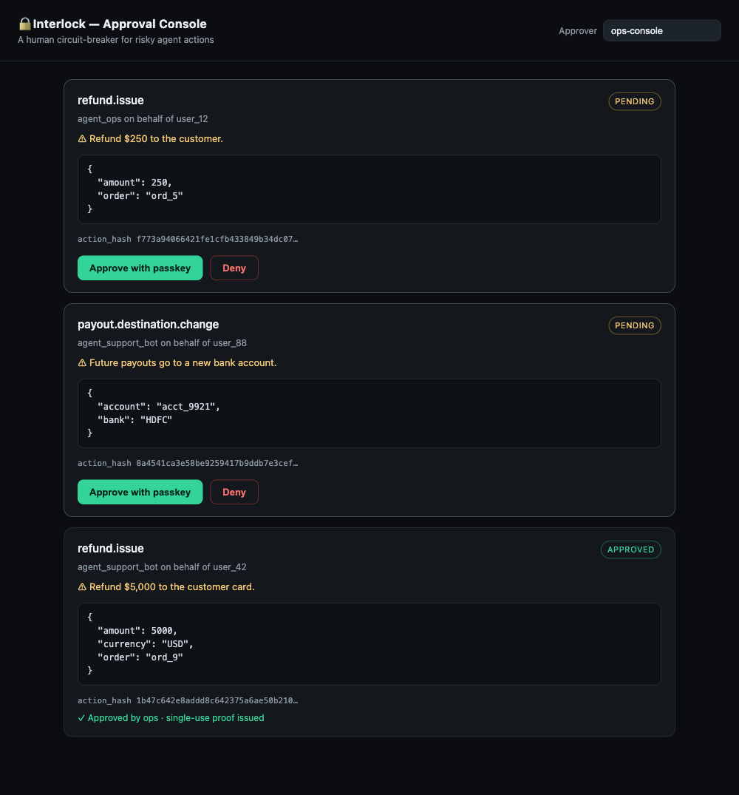

# Interlock

**Agents move fast. Humans hold the keys to the irreversible.**

Interlock is a human-in-the-loop circuit breaker for high-risk AI-agent actions.
An agent *proposes* an action; a risk policy decides whether it can run itself,
needs a human, or must be refused; a human *approves the exact action* (passkey /
click); and a **single-use, action-bound proof** lets the agent execute it
**exactly once**. Every failure path fails closed.

It's built on the **Signet** verification core — the same ES256, action-bound,
verify-then-consume-once, fail-closed proof checks — so the guarantees are real
cryptography, not a status flag an agent could flip.

> Independent project. The proof model follows the GrayPass "Proof of Agency"
> contract (`https://app.graypass.org/docs`); the human-approval layer on top is
> Interlock's own.

## Why this exists

The agent-authorization space (Alter, Multifactor, Agentic Fabriq, …) is racing
to give agents identity and fine-grained permissions. But the genuinely scary
case isn't "can the agent read this row" — it's the **irreversible** action:
wire the money, delete the tenant, email every customer. For those you don't want
a policy that silently allows or denies; you want a **deliberate human in the
loop**, and a guarantee that what the human approved is *exactly* what runs.

Interlock is that primitive:

- the human reviews an **immutable action card** and approves *that* card;
- approval mints a proof **bound to the frozen request** (agent, principal,
  action, params);
- the Guard recomputes the binding from what the agent is **actually** about to
  do, so approve-$10-execute-$10,000 is impossible;
- the proof is **consumed once** — no replays, no double-spend;
- if anything is off, or the authority is unreachable, it **refuses**.

## The loop

```
agent.propose(action) ──▶ RiskPolicy ──┬─ auto_allow      → proof minted now
  (agent, user, params)  │             ├─ needs_approval  → human reviews EXACT
                         │             │                    action, approves w/ passkey
                         │             │                    → single-use proof minted
                         │             └─ deny            → no proof, ever
                         ▼
guard.execute(id, fn) ──▶ Signet core: verify proof (signature + bindings)
                          + recompute hash from ACTUAL params
                          + consume once  ──▶ run fn() exactly once
                          └─ replay / tamper / expired / denied / outage → refuse
```

## Run it

```bash
npm install
npm test        # 29 tests: the loop, HTTP end-to-end, restart durability, + 19 Signet-core reasons
npm run demo    # narrated offline walkthrough (refunds, approval, tamper, deny)
```

## Run it as a service (HTTP API + approval console)

```bash
npm run serve   # starts the server + web console on http://localhost:4000
```

Open **http://localhost:4000/console** — a human reviews each pending action and
approves it with one click (a passkey ceremony in the full build). State is
persisted to `data/interlock.json` (a `FileStore`), so approvals and one-time
consumption survive a restart.



The JSON API:

| Method & path | Who | Does |
|---|---|---|
| `POST /api/propose` | agent | policy decision (+ `approvalId`) |
| `POST /api/proposals/:id/execute` | agent | verify + consume once → go / no-go |
| `GET /api/proposals` | console | list, newest first |
| `POST /api/proposals/:id/approve` | human | approve → mints the single-use proof |
| `POST /api/proposals/:id/deny` | human | deny |

## Use it as a library

```js
import { ApprovalAuthority, Guard, RiskPolicy } from 'interlock';

const authority = await ApprovalAuthority.create({
  policy: RiskPolicy.default({ autoApproveUnder: 100, denyActions: ['account.delete'] }),
});
const guard = new Guard({ authority });

// 1. The agent proposes an action.
const decision = await guard.propose({
  agent: 'agent_support_bot',
  onBehalfOf: 'user_42',
  action: 'refund.issue',
  params: { amount: 5000, currency: 'USD', order: 'ord_9' },
  riskClass: 'high',
  consequence: 'Refund $5,000 to the customer card.',
});

// 2. If it needs a human, show decision.review and collect a passkey approval.
if (decision.outcome === 'needs_approval') {
  await authority.approve(decision.approvalId, { approver: 'ops_alice', method: 'passkey' });
}

// 3. The agent executes through the guard — verified, consumed once, run once.
const result = await guard.execute(decision.approvalId, async () => {
  return issueRefund(5000);              // your business action
});
if (!result.executed) return handleRefusal(result.reason);
```

## What it guarantees (each has a test)

| Scenario | Result |
|---|---|
| Low-risk / small amount | `auto_allow` — runs without a human |
| High-risk / large amount | `needs_approval` — held for a human |
| Execute before approval | refused (`awaiting_approval`) |
| Approved, then executed | runs **exactly once** |
| Same approval replayed | refused (`replayed`) — action not re-run |
| Approve $10, execute $10,000 | refused (`action_hash_mismatch`) |
| Human denies | refused (`denied`) |
| Deny-listed action | `deny` — no approval ever offered |
| Authority unreachable | refused (`unavailable`) — fails closed |
| Approve twice | idempotent — no second proof |

## Design notes

- **RiskPolicy** (`src/policy.js`) — ordered rules → `auto_allow` /
  `require_approval` / `deny`; default is fail-safe (`require_approval`).
- **ApprovalAuthority** (`src/authority.js`) — proposal lifecycle
  (pending → approved/denied/expired) and single-use proof minting on approval.
- **Guard** (`src/guard.js`) — the execution boundary; recomputes the binding
  from the agent's actual params and runs the action at most once.
- **Signet core** (`src/verify-offline.js`, `online.js`, `verifier.js`, …) —
  offline ES256 + claim bindings, then authoritative online consume, fail-closed.

## Mock-first, live-ready

Everything runs offline against an in-memory authority that mints real ES256
proofs. To move the proof authority to a real service, point the Signet core's
`issuer` / `baseUrl` at it and supply a credential — the loop is unchanged.

## Honest limitations

- The approval "passkey" step is modeled as a method label; a real WebAuthn
  ceremony is the next step (see roadmap).
- The canonical action hash uses a documented, deterministic form applied
  identically on both sides; swap in a provider's official hasher for live use.
- `FileStore` is single-process durable; for multiple workers back the store
  with Redis/Postgres. The one-time online consume remains the real single-use
  boundary regardless.

## Roadmap

- [x] Durable storage (`MemoryStore` / `FileStore`, restart-safe)
- [x] HTTP service + web approval console
- [ ] Real WebAuthn passkey approval ceremony
- [ ] Redis/Postgres store adapter for multi-process deployments

## Layout

```
src/
  policy.js          # RiskPolicy: auto_allow / require_approval / deny
  authority.js       # ApprovalAuthority: proposal lifecycle + proof minting
  guard.js           # Guard: execution boundary, exactly-once, fail-closed
  store.js           # MemoryStore / FileStore: durable, restart-safe state
  server.js          # InterlockServer: HTTP API + serves the console
  verifier.js        # Signet: two-phase, fail-closed composer
  verify-offline.js  # Signet: offline crypto + all claim bindings
  online.js          # Signet: online verify + one-time consume
  jwks.js  replay.js  reasons.js  action-hash.js
  mock/server.js     # authority signer + fetch-compatible API (persists key + proofs)
bin/serve.js         # `npm run serve` entry point
public/console.html  # the human approval console UI
test/
  hitl.test.js         # the human-in-the-loop loop
  server.test.js       # HTTP end-to-end (propose -> approve -> execute)
  persistence.test.js  # state survives a restart (FileStore)
  verify.test.js       # the Signet core: one test per refusal reason
examples/demo.js       # narrated offline walkthrough
docs/console.png       # console screenshot
```
